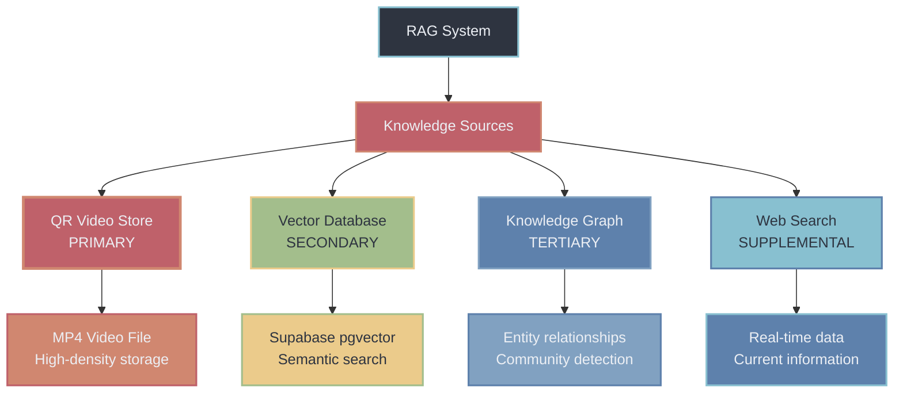
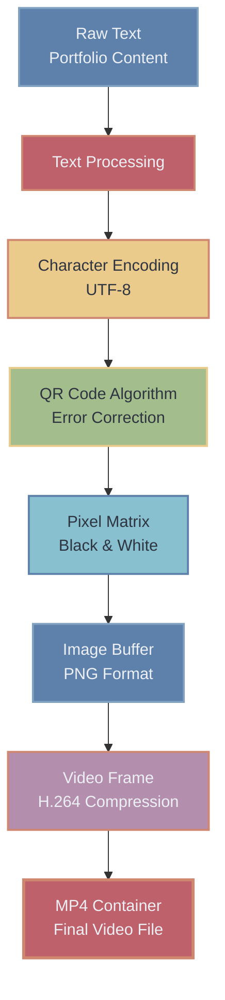
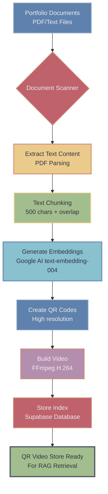
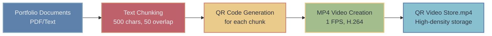
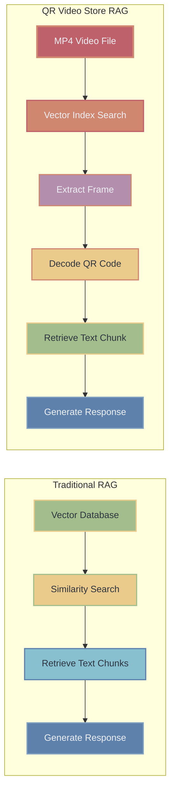
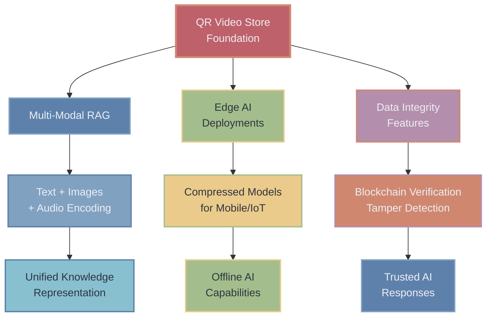

# The QR Video Store: A Novel Approach to High-Density Knowledge Storage in RAG Systems

As an AI software engineer deeply immersed in the world of AI and Retrieval-Augmented Generation (RAG), I'm constantly seeking innovative ways to push the boundaries of how we store, retrieve, and utilize knowledge. In my latest personal portfolio project, I've had the exciting opportunity to develop and integrate a truly novel component: the **QR Video Store**. This system represents a groundbreaking approach to high-density knowledge storage, encoding textual information as QR codes within MP4 video files, and it forms the primary knowledge base for my portfolio's advanced AI chatbot, G.I.A.N.N.E. (Generally Intelligent Agentic Network of Neuro-evolving Entities).

## Why a QR Video Store? The Motivation Behind the Innovation

The traditional RAG paradigm often relies on vector databases for semantic search, which are incredibly powerful but can sometimes be limited by the sheer volume and complexity of data they need to manage. I envisioned a system that could offer:

1.  **Extreme Data Density**: A way to pack a massive amount of information into a compact, easily distributable format.
2.  **Persistent and Accessible Storage**: Knowledge that lives in a standard, universally playable file format, independent of complex database setups.
3.  **Novelty and Engagement**: A unique technological talking point that showcases innovative problem-solving.

The idea of embedding data within video frames, specifically using QR codes, struck me as a compelling solution. Video compression algorithms are highly optimized for storing visual information efficiently. By encoding text as QR codes, we transform textual data into a visual format that can then be highly compressed within a standard MP4 container. This effectively turns a video file into a dense, self-contained knowledge capsule.

## How It Works: Encoding and Retrieval

The QR Video Store operates through a two-phase process: encoding the knowledge into the video and then retrieving it for RAG purposes.

### Data Transformation: Text to QR to Video

The core innovation lies in the multi-step transformation of textual data into a highly compressed video format:

### The Encoding Process: From Text to Pixels to Video

When I initialize the QR Video Store, the system takes all relevant portfolio documents (PDFs, text files) and processes them through a meticulous pipeline:

1.  **Text Chunking**: First, the raw textual content is broken down into manageable chunks, typically around 500 characters, with a small overlap (e.g., 50 characters) to maintain context across chunks. This ensures that each QR code frame contains a coherent segment of information.
2.  **QR Code Generation**: For each text chunk, I dynamically generate a high-resolution QR code. The QR code acts as the visual carrier for the textual data. This step leverages libraries like `qrcode` to convert strings into pixel data.
3.  **MP4 Video Creation**: The generated QR code images, each representing a distinct chunk of information, are then compiled into an MP4 video file. I configured `ffmpeg` (a powerful multimedia framework) to create a video with a very low frame rate, typically 1 frame per second. This means each second of the video literally holds one chunk of information encoded as a QR code. The video is encoded using H.264 for efficient compression.
4.  **Index Storage**: Crucially, alongside the video creation, I also generate and store a metadata index in a Supabase database. This index maps each text chunk to its embedding (generated using Google AI's `text-embedding-004`), its corresponding frame number in the MP4 video, and the original document ID. This vector index is what enables efficient semantic search later.

### The Retrieval Process: Unlocking Knowledge from Video Frames

When a user interacts with G.I.A.N.N.E. and a query requires knowledge from my portfolio, the retrieval process kicks into action:

1.  **Semantic Search**: The user's query is first converted into a vector embedding. This embedding is then used to perform a similarity search against the QR Video Store's metadata index stored in Supabase. The goal here is to identify the most semantically relevant text chunks (and thus, their corresponding frame numbers).
2.  **Frame Extraction**: Once the relevant frame numbers are identified, the system uses `ffmpeg` again, but this time to precisely extract those specific frames as image buffers (e.g., PNGs) from the main `qr_video_store.mp4` file. This is an efficient operation, as we only extract the tiny snippets of video that contain the required information.
3.  **QR Code Decoding**: The extracted image buffers, which are essentially QR code images, are then fed into a QR code decoding library (like `jsQR`). This library reads the pixel data and reconstructs the original text chunk.
4.  **Context Integration**: The decoded text chunks are then provided as the primary context to the AI model (Google AI's Gemini 2.5 Flash), allowing it to generate highly accurate and relevant responses based on the high-density knowledge retrieved from the video store.

## The Advantages of the QR Video Store

This unconventional approach offers several significant benefits to my RAG system:

-   **Unparalleled Density**: Leveraging video compression allows me to store vast amounts of textual data in a remarkably compact format. This is critical for keeping the portfolio lightweight and responsive.
-   **Persistent and Portable Knowledge**: The `qr_video_store.mp4` file is a self-contained unit of knowledge. It can be easily versioned, distributed, and accessed by any system that can play a video and process its frames. This enhances the reliability and accessibility of the knowledge base.
-   **Primary Knowledge Source**: By design, G.I.A.N.N.E. prioritizes information retrieved from the QR Video Store. This ensures that the most current and comprehensive portfolio data is always at the forefront of the AI's responses.
-   **Graceful Degradation**: While the QR Video Store is primary, the overall RAG system is designed with fallback mechanisms. If for any reason the video store is unavailable, the system seamlessly transitions to supplemental vector RAG and other knowledge sources, ensuring continuous functionality.
-   **Showcasing Innovation**: Beyond the technical advantages, the QR Video Store stands as a testament to creative problem-solving in AI. It's an engaging and memorable feature that highlights my ability to think outside the box and implement cutting-edge solutions.

## The Future of High-Density RAG

I believe the concept of embedding knowledge within multimedia formats like video holds immense potential for the future of RAG systems. It opens up new avenues for:

-   **Multi-Modal RAG**: Extending this concept to directly encode and retrieve information from diverse media types, creating truly multi-modal knowledge bases.
-   **Edge AI Deployments**: Packing knowledge into highly compressed video files could be invaluable for AI applications running on resource-constrained devices.
-   **Enhanced Data Integrity**: The inherent properties of video files can offer interesting possibilities for data integrity and tamper detection.

Developing the QR Video Store has been a challenging yet incredibly rewarding experience. It's a key differentiator of my personal portfolio's AI chatbot, and I'm excited to continue exploring its capabilities and the broader implications for high-density knowledge management in AI.
